# C Debugging & Bottleneck Handbook
By Michael Ku

 This handbook was created for a Fall 2025 SoftSys project and reflects the processes, lessons, and approaches I learned while trying to understand how to debug C programs effectively. My goal is to walk through how to interpret what your program is doing, how to detect when things go wrong, and how to actually fix them. Along the way, I’ll also look at example code problem, break down how to determine bugs in the code using different tools and profilers, then go over how to change them to fix the problem and the new outputs that occur. 

To support this handbook, I’ve also created a repository containing all of the source files used throughout the examples. These files include both the broken and fixed versions of the code so you can walk through the changes yourself and see the differences firsthand, while also having a reference copy of the solutions. Everything covered in the handbook will also be explained directly in the document, so you can follow each step without needing to switch back and forth.

## General Debugging Principles
When researching how experienced computer scientists approach debugging in C, I came across several personal philosophies that people follow. The one that resonated with me most was from [James Aspnes](https://www.cs.yale.edu/homes/aspnes/pinewiki/C(2f)Debugging.html), a former Yale professor, who breaks debugging into three simple steps. These steps form the foundation for how I approach debugging throughout this handbook. The three steps are straightforward:
1. Know what your program is supposed to do.
2. Detect when it doesn’t.
3. Fix it.

I like this structure because it cuts through the complexity. It doesn’t require deep technical knowledge to understand, it’s simply a logical way to approach problems. You first define your expectations, then identify where reality doesn’t match, and finally correct the issue.
The first step is the most important: understanding what your code is actually doing. This means knowing what the intended behavior is, but also understanding what’s happening “under the hood.” With C, this can be challenging because it exposes a lot more of the computer’s internals than high-level languages like Python. Python hides details such as memory management and compilation stages, while C puts those responsibilities directly in your hands.
Because of this, debugging in C requires a solid grasp of what’s happening inside the machine. That includes things like the compilation pipeline, pointer behavior, memory allocation, and how different files interact with each other. These concepts can feel like a “black box” at first, but once you understand them, you’ll be much more equipped to debug errors quickly and 


## Compilation Process
Before we can meaningfully debug a C program, we need to understand how a C compiler actually builds an executable. The compilation pipeline is made up of four stages, and each one has its own common sources of errors. By understanding what happens at each step, you can narrow down where a problem originates and avoid searching blindly. Below is an overview of the compilation process that will serve as a reference throughout this handbook.

 

#### 1. Preprocessing
The first stage is preprocessing, which handles everything in your code that begins with a #, such as `#include`, `#define`, and conditional compilation directives like `#ifdef`. In this stage, macros are expanded, header files are inserted, comments are removed, and the preprocessor produces a large intermediate version of your source code. Even though you usually do not inspect this output, understanding what it does helps with debugging issues involving macros, missing declarations, or incorrect include paths.

#### 2. Compilation (C → Assembly)
After preprocessing, the compiler takes the cleaned-up code and translates it into assembly instructions appropriate for your machine’s architecture. This stage also checks for syntax errors, type mismatches, and undefined references within the same translation unit. The result is a `.s` assembly file. This step is important because it determines how your high-level logic becomes low-level instructions, and it’s useful for diagnosing both bugs and performance bottlenecks.

#### 3. Assembly (Assembly → Machine Code)
In this stage, the assembler converts the assembly instructions into machine code, generating an object file (usually with a `.o` extension). This file contains raw binary instructions but may still include unresolved references to external symbols, such as printf or functions defined in other files. At this point, the file is not yet a complete program.

#### 4. Linking
The final stage combines all object files and required libraries into one executable. The linker resolves symbol references and connects everything together. If you see errors like undefined reference to printf, it means the linker cannot find the implementation for a symbol. Understanding this stage is essential for debugging multi-file projects and library-related issues.

Now that each stage is defined, we have a clearer picture of where different types of errors originate. If something goes wrong during compilation, knowing which stage produced the error lets you focus your debugging efforts much more quickly. This understanding will also help when working with GCC flags later in the handbook, since many of them reveal or isolate specific compilation stages.

## GCC Tips & Flags
One of the best things about GCC is the huge variety of flags and options it provides. These flags allow you to customize how your program is compiled and can make debugging dramatically easier. With the right combination of flags, you can get more warnings, expose errors earlier, stop compilation at different stages, or even check your program while it’s running. Below are the categories of GCC flags that I found most helpful while learning to debug C.


#### Warning and Error Flags
One of the simplest and most effective debugging strategies is enabling compiler warnings. By default, C is extremely permissive, and a lot of incorrect or unsafe code will still compile without complaint. Turning on warnings helps you catch problems early. The flags `-Wall` and `-Wextra` enable a broad range of warnings that reveal issues such as unused variables, mismatched types, uninitialized values, ignored return results, and more. The `-Werror` flag goes even further by treating all warnings as errors, which forces you to fix them instead of ignoring them. While this can feel strict, it helps prevent subtle bugs from slipping through.

#### Debugging Information Flags
Tools like GDB and Valgrind can only provide useful information, such as line numbers, variable names, and stack traces, if your program is compiled with debugging symbols. Adding the `-g` flag embeds this information into the executable without changing how your program behaves. There is also a more specialized version, `-ggdb`, which optimizes debugging information specifically for GDB. In most cases, `-g` is perfectly sufficient, but both options are essential when you plan to debug your program.

#### Flags That Expose Compilation Stages
Earlier, we walked through the four stages of compilation. GCC allows you to stop the process at different stages so you can inspect what’s going on. For example, `-E` runs only the preprocessor and outputs the processed code. `-S` stops after generating assembly so you can inspect the `.s` file. `-c` compiles the code into an object file without linking it. These flags are especially helpful when debugging issues related to macros, missing includes, or performance, since inspecting assembly lets you see how your C code is translated.

#### Linking and Output Flags
Some GCC flags help control how your final executable is linked. The most common one is `-o`, which lets you name the output file. Others, like `-L` and `-l`, help you link external libraries or specify additional search paths. These options become particularly important as your C programs grow, especially when you start seeing errors such as “undefined reference,” which indicates a linking problem rather than a compilation one.

## GDB Overview
GDB (the GNU Debugger) is one of the most powerful tools available for debugging C programs. It gives you the ability to look inside your program while it is running and understand exactly what is happening. Instead of guessing why your program behaves incorrectly or crashes, you can observe its execution step-by-step, inspect variables, check memory, and control the flow of execution. This kind of visibility makes it possible to track down segmentation faults, incorrect logic, and unexpected data changes that would be extremely difficult to diagnose by simply reading code or printing values.

To use GDB effectively, you must compile your program with debugging information included. This is done by adding the -g flag when compiling with GCC, such as: `gcc -g main.c -o main`.
The `-g` flag embeds symbols like line numbers, function names, and variable names into the executable so GDB can map machine instructions back to your original source code. Without `-g`, GDB can still run your program, but all you’ll see are memory addresses instead of useful line references. Once your program is compiled with debugging symbols, you can start GDB by running: `gdb ./<program>`.

Inside the GDB environment, you can run your program just as you normally would using the run command. If the program crashes, GDB will immediately show you the exact line where it failed and allow you to inspect the state of the program. This is especially helpful for diagnosing segmentation faults, since GDB shows not only where the crash happened but also how the program reached that point.

GDB provides a variety of commands that make debugging interactive and precise. Breakpoints (`break <line>`) let you pause execution at specific lines so you can examine variables before an error occurs. The commands next and step allow you to advance through your program line-by-line. next executes the current line without stepping into function calls, while step goes inside the function being called so you can trace deeper logic. You can use the print command to inspect variables or expressions at any time, which is incredibly useful for tracking down incorrect values. 

If your program behaves unexpectedly, the `backtrace` command shows the call stack, revealing the sequence of function calls that led to the current point. This is essential for debugging crashes and recursion issues. GDB also supports watchpoints using the watch command, which tells GDB to pause execution whenever a specific variable is modified. This feature is especially powerful when a variable changes unexpectedly and you want to know exactly where that change occurs.

In addition to these debugging features, GDB can inspect raw memory, display CPU registers, and disassemble compiled machine code. These advanced capabilities are helpful when dealing with lower-level bugs or performance bottlenecks. While you won’t need these features for every program, having them available makes GDB an incredibly flexible tool.

Overall, GDB is essential for developing and debugging C programs. Combined with helpful compiler flags like `-g`, `-Wall` provides a complete workflow for identifying crashes, memory errors, and incorrect behavior. Learning to use it effectively is one of the most important skills for understanding your code and fixing bugs systematically. For more help, I would encourage to check out the [GDB documentation](https://www.gnu.org/software/gdb/documentation/) or a cheat sheet I found [here](https://darkdust.net/files/GDB%20Cheat%20Sheet.pdf).

## Valgrind Overview
Valgrind is a powerful analysis tool used to detect memory leaks, memory misuse, and certain types of performance problems in C programs. Valgrind runs your program inside a special virtual machine that monitors every single memory operation. This makes it slower, but also incredibly thorough. Valgrind can catch issues such as invalid memory reads/writes, use-after-free errors, double frees, uninitialized memory access, and many other problems that can easily go unnoticed during normal execution. Using Valgrind is straightforward. First, compile your program with the -g flag so that debug information is available. For example: `gcc -g main.c -o main`.

Instead of running your program normally, you run it under Valgrind using: `valgrind ./<program>`.
Valgrind immediately begins monitoring the program and reports any invalid memory operations as they occur. When the program finishes, Valgrind prints a detailed summary of memory leaks, including how many bytes were leaked, whether the leaks are reachable or not, and where the leaked memory was originally allocated.

Valgrind’s main memory-checking tool is called Memcheck, and it is the one most commonly used for debugging. Memcheck identifies issues like reading from uninitialized memory, accessing memory outside the bounds of an allocation, or using memory that has already been freed. When it detects a problem, Valgrind reports a descriptive error message, the exact line of code where the invalid access happened, and a backtrace showing how the program reached that point. Because it monitors every memory operation, it can catch subtle problems that might not appear consistently during normal execution.

Valgrind is also extremely useful for tracking memory leaks. At the end of your program’s execution, it prints a leak summary showing how many bytes of memory were lost and where those allocations came from. This is especially helpful in larger programs or long-running systems where memory leaks can accumulate over time. If you want even more detail, you can run Valgrind with the flag `--leak-check=full`, which produces a complete, line-by-line report of every leaked allocation. This is what we will use in most cases as more information is better! For more help with Valgrind, I recommend checking out the [Valgrind documentation](https://valgrind.org/docs/manual/quick-start.html)

## Debugging Walkthrough (Program Example)
Now that we have covered the major tools and concepts, the best next step is to walk through an actual debugging process. In this section, we will take a simple C program, run it, observe the errors it produces, and use what we have learned from GDB, Valgrind, compiler flags, and general debugging principles to fix those issues. I will include screenshots and references to the example repository so you can follow along and compare the before and after versions of the code.

### Example Problem:
The example program simulates a very basic multithreaded sensor system. Its intended behavior is straightforward: it loads configuration text from a file, initializes a set of sensor readings, creates two threads that update those readings, computes the average of all sensor values, and prints the results. The workflow reflects a simple real-world pattern: load data, update data in the background, then process and output a final result.

#### [`src/main.c`](src/main.c) → Program Controller:
The main file orchestrates the entire program. It prints a startup banner, loads a configuration file, initializes the sensor system, launches two worker threads, computes the average of the sensor values, prints the results, and exits. It acts as the central driver that ties all modules together.

#### [`src/sensor.c`](src/sensor.c) → Sensor System Logic
This file contains the implementation of everything related to sensors: allocating and initializing a SensorData structure, filling it with initial values, running the thread function that updates those values, computing the average, and cleaning up memory at the end.

#### [`src/sensor.h`](src/sensor.h) → Sensor Interface
The header file exposes the SensorData struct along with the function prototypes for initialization, threaded updating, computing averages, and freeing memory. It also includes the necessary threading-related headers.

#### [`src/utils.c`](src/utils.c) → Helper Utility Functions
This file contains general-purpose helper functions, including reading a file into memory, converting strings into integers, and printing a formatted program banner. These utilities are separated from the core sensor logic to keep the code organized.

#### [`src/utils.h`](src/utils.h) → Utility Function Declarations
This header declares the utility functions so that other source files, especially main.c, can use them without duplicating code.

#### [`src/CMakeLists.txt`](src/CMakeLists.txt) → Build Instructions
The Makefile includes all compilation rules required to build the program. It defines the compiler, compiler flags, file dependencies, and the steps for generating object files and linking them into the final executable, sensor_program.

If everything worked perfectly, the program would print the banner, display the configuration file contents, compute and display the average sensor reading, and print the configuration again. However, when we first run the program, the output shows several errors that reveal issues within multiple parts of the code.

After building and running the program, this is the result we get in our terminal: 

 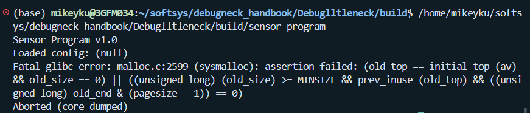

Let’s go through the problems one at a time. The first noticeable issue is that the “loaded config” text prints as null. That immediately suggests a problem in the code responsible for reading the file. The configuration file itself does exist, so the issue likely stems from how the file is read or how memory is handled. This leads us straight to the `read_file` function in utils.c.

 ```
 char* read_file(const char* path) {
    FILE* f = fopen(path, "r");
    if (!f) return NULL;

    char buffer[256];
    fread(buffer, 1, 255, f);
    buffer[255] = '\0';
    fclose(f);
    return buffer;
}
```

Inside `read_file` , we see that the function takes a file path and returns a char* that should point to a buffer containing the file contents. The function can return NULL for two reasons: either the file cannot be opened, or something went wrong while reading it. At first glance everything seems reasonable, but the real problem is that the function creates a buffer as a local variable on the stack and then returns a pointer to it. Because that buffer goes out of scope as soon as the function returns, the pointer becomes invalid, which results in a dangling pointer. This explains why the config variable in main.c prints as NULL.

To fix this, we first ensure that the file is placed in the correct directory so it can actually be opened. Then, instead of having the buffer as a local variable, we allocate memory for it on the heap using malloc. We read the file contents into this allocated space and then return that pointer. Since heap memory persists beyond the end of the function, main.c can safely use the returned string.


 ```c
 char* read_file(const char* path) {
    FILE* f = fopen(path, "r");
    if (!f) return NULL;

    char* buffer = malloc(256);
    fread(buffer, 1, 255, f);
    buffer[255] = '\0';
    fclose(f);
    return buffer;
}
 ```

After making this change and re-running the program, the configuration loads correctly, confirming that the bug is fixed.

 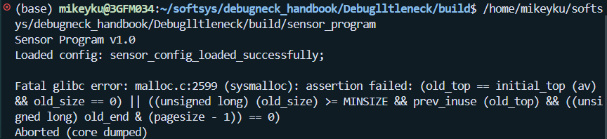

After fixing the file loading issue, the program moves on but quickly encounters a `fatal glibc` error. Looking at the error message and researching common causes, it becomes clear that this type of error often results from incorrect dynamic memory usage, specifically mistakes involving heap allocation, out of bounds writes, or incorrect freeing of memory. To identify the cause, we need to examine the rest of the program, especially the functions that manipulate dynamically allocated memory.

Let’s turn our attention to [`sensor.c`](src/sensor.c), which defines the sensor system. It includes several key functions:

- `init_sensor` is used for allocating and initializing sensor data. This can be seen below:
  
```c
SensorData* init_sensor(int count) {
    SensorData* s = malloc(sizeof(SensorData));
    s->readings = malloc(sizeof(int) * count);
    s->count = count;
    pthread_mutex_init(&s->lock, NULL);
    for (int i = 0; i < count; i++) {
        s->readings[i] = rand() % 100;
    }
    return s;
}
```
- `sensor_thread` for updating the readings in each thread. This is shown below:
  
```c
void* sensor_thread(void* arg) {    
    SensorData* s = (SensorData*) arg;
    pthread_mutex_lock(&s->lock);
    for (int i = 0; i < s->count; i++) {
        s->readings[i] += 5;
    }
    pthread_mutex_unlock(&s->lock);
    return NULL;
}
```
- `compute_average` is for processing the final values and computing averages.
  
```c
double compute_average(SensorData* s) {
    int sum = 0;
    for (int i = 0; i < s->count; i++) {
        sum += s->readings[i];
    }
    return sum / s->count;
}
```

- `free_sensor` for cleaning up allocated memory.

```c
void free_sensor(SensorData* s) {
    free(s->readings);
    free(s);
}
```
 
Understanding how each of these functions handles memory is essential for diagnosing the glibc error.

Now that we understand this file, let’s go through each function one by one and see where issues might be happening. The first function that stands out is `init_sensor`. In this function, we write values into our struct. The malloc call itself is correct because we are allocating the right amount of space, but the problem appears when we start assigning values into that space.

Right now, the loop runs from 0 to count, which means it writes one extra element past the allocated memory. This causes heap corruption issues. To fix this, we just need to change the loop condition from “less than or equal to” to “less than,” ensuring we stay within the valid memory range.

After making this change, I wanted to dig deeper into the error, so I ran GDB to test things out. I did this by running `gdb ./sensor_program` inside the build folder. When I did, this was the result:

 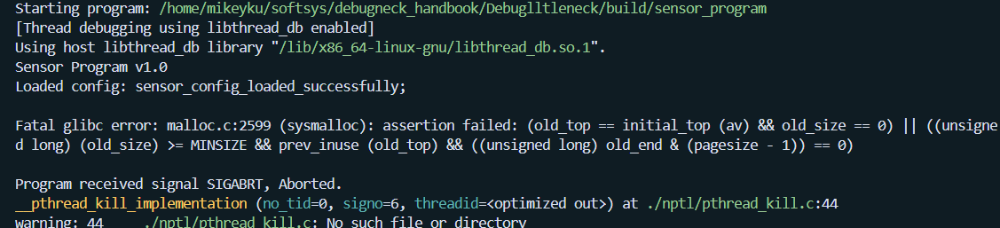

When we look at this output, we can see that the program still aborted with the same glibc error. After noticing that, I went back to the function we modified and remembered something important. In the definition of the `SensorData` structure, there are three fields that must be correctly initialized. This structure is shown below:

```c
typedef struct {
    int* readings;
    int count;
    pthread_mutex_t lock;
} SensorData;
```

From this, we can also see that the struct contains a mutex that needs to be properly initialized. In our current code, this mutex was never initialized, which can lead to serious errors during runtime. To fix this, we need to initialize the mutex inside the init_sensor function. Below is the updated version of the init_sensor function:

```c
SensorData* init_sensor(int count) {
    SensorData* s = malloc(sizeof(SensorData));
    s->readings = malloc(sizeof(int) * count);
    s->count = count;
    pthread_mutex_init(&s->lock, NULL);
    for (int i = 0; i < count; i++) {
        s->readings[i] = rand() % 100;
    }
    return s;
}
```

Now when we run our program in the GDB our response looks like this:

 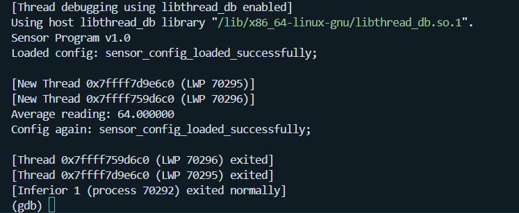

With this fix in place, it looks like our main problem is solved. The threads run correctly, and the average reading is computed and printed as expected. This is great because it works and produces the output we want. However, that does not necessarily mean everything is functioning exactly the way we intend. There are still other checks we should perform, especially when it comes to memory usage.

This is where Valgrind comes into play, since it's one of the best tools for detecting memory issues. To run Valgrind, we used: `valgrind ./sensor_program`
This gave us a clear summary of the memory leaks:

 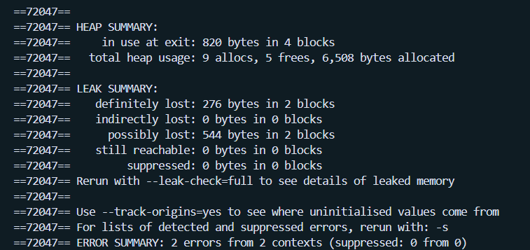

From this output, we can clearly see that a significant number of bytes were definitely lost, and some may have been only possibly lost. This is not ideal, and we need to understand where these leaks are coming from and how to fix them. To investigate further, we ran Valgrind with the full leak check option: `valgrind --leak-check=full ./sensor_program`

This gives a detailed breakdown of exactly where the memory issues occur. Here is the full summary:

 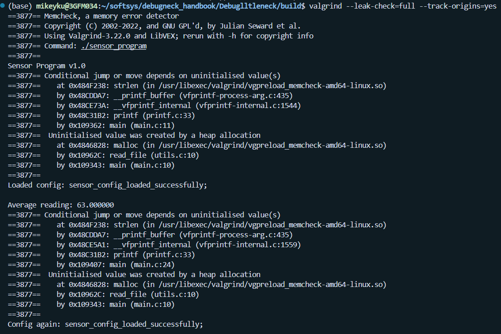

 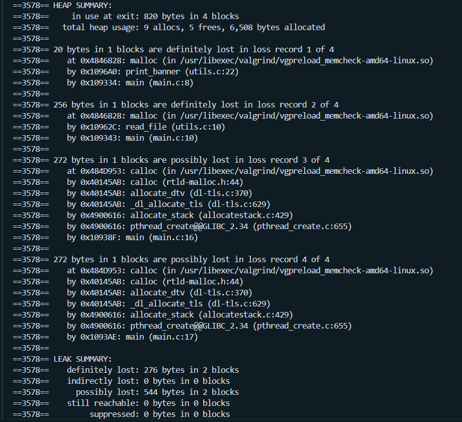

Now that we have the full summary, we can start identifying where things went wrong and tackle the issues one by one. The first error we see is a conditional jump based on uninitialized values. Valgrind reports this happening in `main.c` on lines 10 and 11. Since those lines rely on the results returned by the `read_file` function, that’s the next place we should inspect.

Looking at `read_file`, we notice a key problem: when we allocate memory and start writing values into the buffer, there is a possibility that not all elements get written, especially if the file content is shorter than the allocated size. That means some of the allocated space remains uninitialized, and those uninitialized values propagate to the rest of the program.

To fix this, the simplest solution is to replace malloc with calloc. calloc automatically initializes all allocated memory to zero, ensuring there are no uninitialized values even if we don't overwrite every element.

 ```c
 char* read_file(const char* path) {
    FILE* f = fopen(path, "r");
    if (!f) return NULL;
    char* buffer = calloc(1,256);
    fread(buffer, 1, 255, f);
    buffer[255] = '\0';
    fclose(f);
    return buffer;
}
 ```
After making that change, the conditional jump warnings disappear, which lets us turn our attention to the memory leaks. Valgrind still reports issues in `read_file`, specifically memory that was allocated but never freed. This happens because we allocate space inside the function but never release it once we’re done using it.

The fix is straightforward: after we finish using the data returned by `read_file`, we need to free that memory. In this case, the config variable holds the returned buffer, so we simply add a `free(config)`; statement after the final printf in main.c. This ensures that the space allocated in `read_file` is properly freed before the program exits.

Once that issue is resolved, we can move on to the next leak Valgrind reports, which is in `main.c` on line 8 and points directly to the print_banner function in `utils.c`. Here we have another clear example of allocating memory with malloc but never freeing it, which leads to definite memory loss.

The fix is simple: after we finish printing the banner, we need to free the msg variable that was allocated. Adding a `free(msg);` at the end of the print_banner function ensures that this memory is properly released.

```c
void print_banner() {
    char *msg = malloc(20);
    strcpy(msg, "Sensor Program v1.0");
    printf("%s\n", msg);
    free(msg);
}
```
This fixes that memory issue, and after applying this change, Valgrind reports zero definitely lost bytes, which means all confirmed leaks are resolved. However, we still have a few possible leaks that Valgrind flags. These are not guaranteed leaks, but they are still worth investigating to make sure everything is fully cleaned up. Here is the current Valgrind output:

 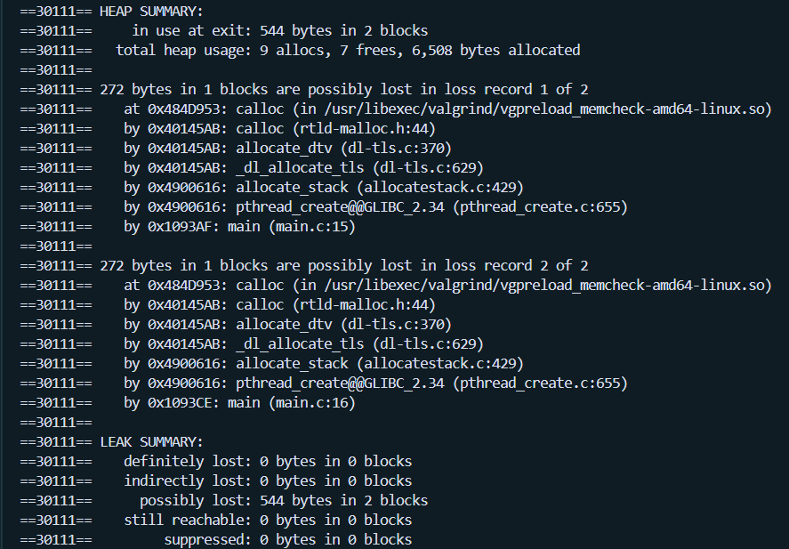

Now we can address the final two issues, both of which are reported as possible memory losses. These occur when we create our threads. If a thread finishes executing but is never joined, it becomes what is known as a "zombie" thread. Its execution is complete, but some of its resources remain allocated because the parent thread never acknowledged that it ended.

To fix this, we use `pthread_join`, which tells the system that the thread has finished and allows its resources to be fully cleaned up. Once we add `pthread_join` calls for both threads, the updated main.c file looks like this:

```c
int main() {
    print_banner();
    char* config = read_file("config.txt");
    printf("Loaded config: %s\n", config);
    SensorData* sensor_data = init_sensor(10);
    pthread_t t1, t2;
    pthread_create(&t1, NULL, sensor_thread, sensor);
    pthread_create(&t2, NULL, sensor_thread, sensor);
    pthread_join(t1, NULL);
    pthread_join(t2, NULL);
    double avg = compute_average(sensor);
    printf("Average reading: %f\n", avg);
    free_sensor(sensor);
    free(config);
    return 0;
}
```
After this, our valgrind looks clean:

 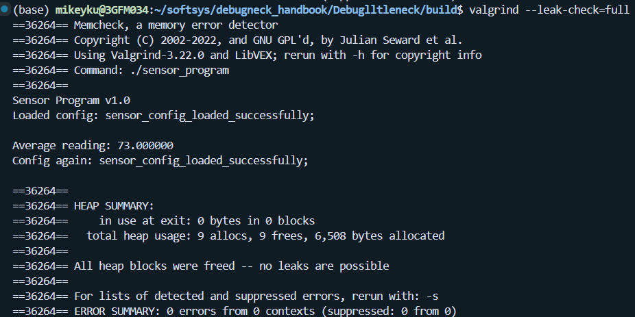

Now that Valgrind shows a clean result and our program compiles correctly, we can step back and review everything. At this point, we want to make sure the program outputs what we expect, verify that it runs efficiently, and confirm that it’s written in a clean and optimized way. With the memory issues resolved, we can now shift our attention to performance and discuss how to identify and fix bottlenecks in a program.

Let’s take a moment to walk through the best methods for detecting bottlenecks and improving overall performance.

## Bottleneck rundown
When I started looking into bottlenecks, the first thing I learned is that the biggest slowdowns usually come from functions that run all the time. If a function gets called millions of times, it does not matter how small it looks, it will dominate your runtime. These hot spots usually hide inside loops, nested loops, or recursive calls. So a good rule of thumb I picked up is this: the more often a piece of code runs, the more impact even a tiny optimization can have.

I also realized that a lot of bottlenecks come from doing work we don’t actually need to do. Sometimes programs repeatedly calculate the same thing when they could just compute it once and reuse it. Things like re-scanning arrays in loops, sorting the same data over and over, creating temporary buffers inside loops, or doing expensive operations like division or string manipulation can really add up. Cleaning up that repeated work can make a program noticeably faster.

Memory issues turned out to be another big one. Memory leaks slowly eat away at your available memory, especially in longer running programs. But even without leaks, constantly allocating and freeing memory inside loops slows things down because heap operations are expensive. Copying large chunks of memory more than necessary has a similar effect. So keeping memory usage tidy, freeing what you allocate, reusing buffers, and avoiding unnecessary copying, goes a long way in reducing bottlenecks.

On a lower level, bottlenecks can also come from the way the compiler has to translate your code to assembly. If the code has too much branching, loads and stores all over the place, or expensive operations in hot loops, the compiler can’t optimize it well. Things like division, modulo, and pointer aliasing slow things down more than you might expect. Learning a bit about how C turns into assembly really helped me understand why some patterns are slower than others.

Fixing bottlenecks usually comes down to reducing repeated work, picking better algorithms, tightening loops, cutting unnecessary memory operations, eliminating leaks, caching expensive results, reusing buffers, and simplifying code so the compiler can optimize it better. Sometimes the fix is literally as simple as moving a malloc out of a loop. Other times, you need to rethink the whole approach or swap in a more efficient data structure.

After going through all this, I also learned what the most common bottlenecks look like in C: loops that run more times than needed, unnecessary calculations inside loops, repeated memory allocations or copying, memory leaks, slow algorithms like repeated sorting, too many branches, pointer aliasing that blocks compiler optimizations, string operations inside hot loops, and expensive operations like division in frequently-run code.

Now that I’ve gone through the main causes of bottlenecks and how to fix them, it’s time to actually debottleneck our own program.

## Debottlenecking Walkthrough
Now that the program is working correctly, I wanted to step back and think about what the original goals actually were. Our program is supposed to do three main things:
1. Load a configuration file and print out the text that was loaded.
2. Simulate sensor processing by using two threads to update an array of sensor readings.
3. Compute and print the average of those processed readings.
These goals stay the same no matter what, but now that everything runs without errors, we can finally look at where bottlenecks might appear and how to fix them.

To analyze performance, I decided to use `gprof` as the main profiler. To get gprof working, we need to adjust our CMake setup because gprof requires some extra compiler flags. The most important one is `-pg`, which enables profiling by tracking function calls and timing information. Without this flag, gprof can't generate the output file we need.
So, I updated the CMakeLists file and applied the `-pg` flag to the sensor_program target. After the change, the CMake configuration looks something like this:

 ```cmake
 cmake_minimum_required(VERSION 3.10)

project(sensor_project C)

set(CMAKE_C_STANDARD 11)
set(CMAKE_C_FLAGS "${CMAKE_C_FLAGS} -Wall -Wextra -g")

add_executable(sensor_program
    main.c
    sensor.c
    utils.c
)

target_compile_options(sensor_program PRIVATE -pg)
target_link_options(sensor_program PRIVATE -pg)

find_package(Threads REQUIRED)
target_link_libraries(sensor_program PRIVATE Threads::Threads)
```

With that change in place, running the program from the command line now generates a gmon.out file. That file is where all the profiling data gets stored. Once it appears, we can run the gprof command to turn that raw data into a readable report. That report will show us exactly how much time each function took and where the program spent most of its effort.

 

Running this will generate a profile.report.txt file that we can use to examine our program's performance, including which functions ran, how often they ran, and how much time they took. However, when I ran the code the first time, the report did not really tell us much:

 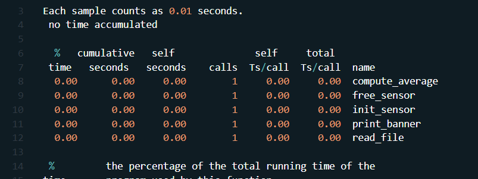

The reason the first report didn’t show much is because our program isn’t really doing enough work, the amount of data being processed is so small that everything finishes almost instantly. That makes it hard for gprof to capture meaningful performance metrics.

To fix that, we need to "stress" the program a bit so we can actually see how it behaves under a larger workload. The easiest way to do this is to increase the amount of sensor data it processes. In main.c, I changed the input to init_sensor from 10 to 20000. This forces the program to run longer and gives the profiler something real to measure.

After making this change, our profiling table looks like this:

 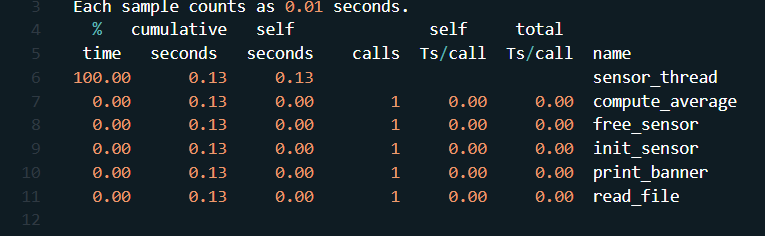

Looking at this updated profile, one thing immediately stands out: sensor_thread is taking up 100 percent of the program's runtime. That means almost all of our execution time is spent inside this function, while the rest of the program runs so quickly that it barely registers on the profiler. This tells us that the sensor thread is our biggest bottleneck, and it is the part of the program that slows everything else down.

Now that we know where the slowdown is happening, we can focus directly on this function and look for ways to speed it up. Here is the current version of our sensor_thread function:

```c
void* sensor_thread(void* arg) {    
    SensorData* s = (SensorData*) arg;

    for (int i = 0; i < s->count; i++) {
        pthread_mutex_lock(&s->lock);
        s->readings[i] += 5;
        pthread_mutex_unlock(&s->lock);
        usleep(5000); 
    }
    return NULL;
}
```

Now let’s take a closer look at why this function is taking so much time. The biggest issue becomes obvious pretty quickly: inside this loop, which can run tens of thousands of times, we lock and unlock the mutex every single iteration. Mutex operations are expensive, and doing them repeatedly in a tight loop adds a huge amount of overhead.

For example, when we use 50,000 readings, we end up doing:
- 50,000 mutex locks
- 50,000 mutex unlocks
- 50,000 full kernel context switches
- 50,000 scheduler events
- 50,000 times where each thread has to wait on the other
All of that work adds up fast and completely dominates the runtime.

To fix this, we can move the lock and unlock outside the loop. That way, we lock once, update everything, and unlock once. This massively reduces the overhead and removes a huge amount of thread contention.

While we're debugging, we can also comment out or remove the usleep call, since that introduces additional delay and makes profiling harder.

With these changes in mind, the improved version of the sensor_thread function looks like this:

```c
void* sensor_thread(void* arg) {    
    SensorData* s = (SensorData*) arg;
    pthread_mutex_lock(&s->lock);
    for (int i = 0; i < s->count; i++) {
        s->readings[i] += 5;
    }
    pthread_mutex_unlock(&s->lock);
    return NULL;
}
```

With these changes, we have now targeted the biggest bottleneck in our program and removed one of the main reasons it used so much time and computing power. After getting rid of all the unnecessary mutex operations inside the loop, the function runs much faster. It becomes so fast that gprof can barely record it anymore, and the program performs almost the same as when we were only processing 10 values.

The final profiling report is shown below:

 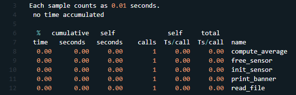

There you have it. We have officially debugged and debottlenecked this program. Even though this program is pretty simple and does not have much going on, the ideas we used here translate to almost any other program. When you start debugging more complicated projects, you will run into a lot more cross-file interactions that can cause unexpected behavior. You might also get an output that looks correct at first but is actually wrong because you used the wrong operation or handled a variable incorrectly.

One of the best ways to track down these kinds of issues is to print out key variables at different points in the program. This helps you pinpoint exactly where things start to go wrong. If a value suddenly changes after a specific function call, you know that the issue is somewhere in that area. For trickier bugs, using GDB to stop the program at certain lines and inspect the state directly is incredibly helpful.

On the performance side, many bottlenecks come from repeated or unnecessary work, like calling the same expensive function over and over. This program had an example of that, but larger programs introduce even more opportunities for improvement. Sometimes the solution is to distribute the workload across threads or processes. Sometimes the fix is removing repeated calculations or reusing results that you already computed. The main idea is to catch anything that wastes time or repeats work.

There are many resources online that go deeper into profiling tools, debugging strategies, and optimization techniques. What I showed here is the path I took to understand how debugging and bottleneck analysis work in practice. I hope walking through this process was helpful and that you enjoyed learning about it.
